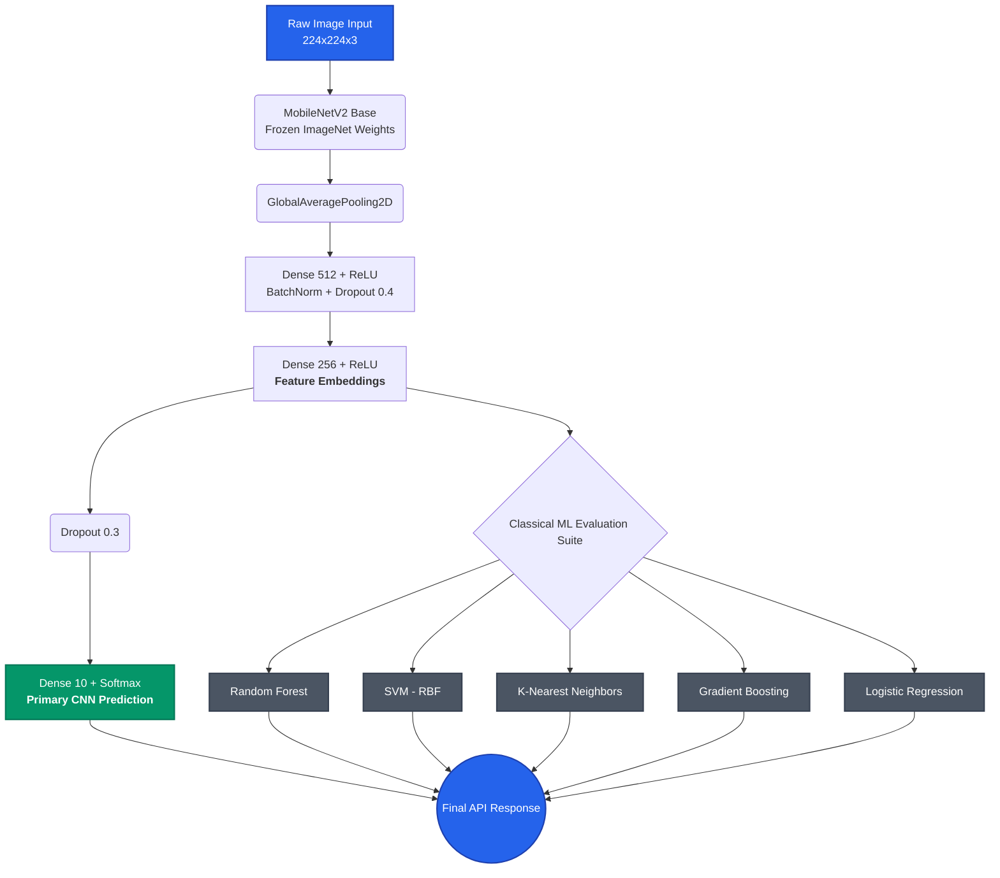

<div align="center">
  <h1>🦁 Wildlife Track AI</h1>
  
  <p><strong>Enterprise-Grade Wildlife Monitoring & Re-Identification System</strong></p>

  [](https://git.io/typing-svg)

  <p>
    <a href="#features"></a>
    <a href="#architecture"></a>
    <a href="#quick-start"></a>
    <br>
    
    
    
    
  </p>
</div>

---

## 📑 Table of Contents
1. [Overview](#-overview)
2. [Core Features](#-core-features)
3. [System Architecture](#-system-architecture)
4. [Tech Stack](#-tech-stack)
5. [Quick Start](#-quick-start)
6. [API Reference](#-api-reference)
7. [Dataset Configuration](#-dataset-configuration)
8. [License](#-license)

---

## 🔭 Overview
**Wildlife Track AI** is a state-of-the-art computer vision platform designed for ecological monitoring and wildlife conservation. Utilizing deep transfer learning via **MobileNetV2**, the system provides high-accuracy species classification and individual animal face recognition. It features a robust multi-model evaluation pipeline, benchmarking Deep Learning embeddings against Classical Machine Learning algorithms (Random Forest, SVM, KNN, GBM, Logistic Regression) in real-time.

---

## 🚀 Core Features

| Module | Description | Technology |
| :--- | :--- | :--- |
| 🧠 **Deep Learning Classifier** | 10-class wildlife species recognition engine utilizing pre-trained ImageNet weights. | `TensorFlow` / `MobileNetV2` |
| 👁️ **Individual Re-Identification** | Tracks specific animals using CNN embedding vectors and Cosine Similarity matching. | `OpenCV` / `SciPy` |
| ⚖️ **Ensemble Model Inference** | Benchmarks the CNN against 5 parallel supervised classical ML models. | `scikit-learn` |
| 📊 **Real-time Analytics Dashboard** | Glassmorphism-themed premium UI providing live inference results and accuracy charts. | `Chart.js` / `CSS3` |
| 🔄 **Automated Data Pipeline** | Built-in synthetic image generator and data augmentation for immediate bootstrapping. | `PIL` / `NumPy` |

---

## 🏗️ System Architecture

The inference pipeline extracts high-level semantic features using MobileNetV2's convolutional base, routes them through a custom dense head for classification, and simultaneously feeds the intermediate embeddings to a classical ML suite for comparative analysis.



---

## 🛠️ Tech Stack

<details>
<summary><b>View Detailed Technology Stack</b></summary>
<br>

- **Core Backend Framework**: `Flask`, `Flask-CORS`
- **Deep Learning & Neural Networks**: `TensorFlow 2.x`, `Keras`
- **Machine Learning**: `scikit-learn` (Random Forest, SVM, KNN, Gradient Boosting, Logistic Regression)
- **Computer Vision & Image Processing**: `OpenCV`, `Pillow (PIL)`, `NumPy`
- **Frontend Layer**: `HTML5`, `Vanilla CSS3` (Glassmorphism UI), `JavaScript (ES6+)`, `Chart.js`
</details>

---

## ⚙️ Quick Start

### 1. Environment Setup

Clone the repository and provision the virtual environment.

```bash
git clone https://github.com/AbhyanandSharma2005/Wildlife-Track-AI.git
cd Wildlife-Track-AI

# Create virtual environment
python -m venv venv

# Activate environment (Windows)
venv\Scripts\activate
# Activate environment (macOS/Linux)
# source venv/bin/activate

# Install dependencies
pip install -r requirements.txt
```

### 2. Model Training

The system requires initial model training. If a custom dataset is not provided, the pipeline will auto-generate synthetic data for immediate testing.

```bash
# Default synthetic training
python model/train.py

# Advanced configuration (200 samples, 20 epochs)
python model/train.py --samples 200 --epochs 20
```

### 3. Launching the Application

Boot the Flask API and serve the frontend dashboard.

```bash
python app.py
```
> **Access the Dashboard:** Navigate to [http://localhost:5000](http://localhost:5000) in your browser.

---

## 🔌 API Reference

The backend exposes a RESTful API for seamless integration with external services.

| HTTP Method | Endpoint | Description | Payload |
| :---: | :--- | :--- | :--- |
| <kbd>GET</kbd> | `/health` | System health check and status | - |
| <kbd>POST</kbd> | `/api/predict` | Runs image through CNN and 5 ML models | `multipart/form-data` |
| <kbd>POST</kbd> | `/api/train` | Triggers background model retraining | JSON config |
| <kbd>GET</kbd> | `/api/status` | Retrieves training status & model metrics | - |
| <kbd>GET</kbd> | `/api/comparison` | Fetches historical benchmark data | - |
| <kbd>POST</kbd> | `/api/register-animal` | Registers a face embedding for Re-ID | `multipart/form-data` |
| <kbd>GET</kbd> | `/api/known-animals` | Lists all registered animal IDs | - |

---

## 🗄️ Dataset Configuration

To train the system on real-world datasets (e.g., [Animals-10](https://www.kaggle.com/datasets/alessiocorrado99/animals10), [iNaturalist](https://www.inaturalist.org/)), structure your `data/raw/` directory as follows:

```text
Wildlife-Track-AI/
└── data/
    └── raw/
        ├── Tiger/
        │   ├── img_001.jpg
        │   └── img_002.jpg
        ├── Lion/
        │   └── ...
        └── Elephant/
            └── ...
```

Execute training while bypassing the synthetic generator:

```bash
python model/train.py --no-generate --epochs 30
```

---

## 📜 License

Distributed under the MIT License. See `LICENSE` for more information.

<div align="center">
  <sub>Built with ❤️ for Wildlife Conservation</sub>
</div>
